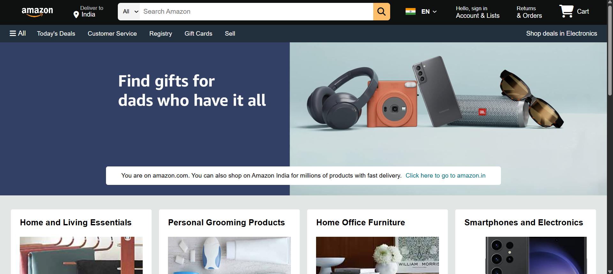

# Amazon Clone - Frontend Replica

This project is a frontend replica of the Amazon.com homepage, built primarily with HTML5 and CSS3. The goal was to meticulously recreate the visual appearance and layout of a complex, real-world e-commerce website, focusing on responsive design and attention to UI/UX details.

It serves as a demonstration of my abilities in:
*   Semantic HTML structure.
*   Advanced CSS for layout (Flexbox, Grid), styling, and responsiveness.
*   Faithful UI replication from a complex design.
*   Implementing responsive design principles for various screen sizes.


---

## 📸 Screenshots

Here's a glimpse of the project:

**Desktop View:**


<!-- **Mobile View:**

*(Replace with your actual screenshot path)* -->

---

## ✨ Features Implemented

*   **Responsive Navigation Bar:**
    *   Amazon Logo
    *   "Deliver to" address section
    *   Comprehensive search bar with a dropdown category selector
    *   Language/Region selector
    *   "Account & Lists" dropdown placeholder
    *   "Returns & Orders" section
    *   Shopping Cart icon and label
*   **Secondary Panel Navigation:**
    *   "All" menu (hamburger icon)
    *   Quick links: Today's Deals, Customer Service, Registry, Gift Cards, Sell
    *   Promotional link for "Shop deals in Electronics"
*   **Hero Section:**
    *   Large background image.
    *   Informational message box with a link to amazon.in.
*   **Product Grid Section:**
    *   Responsive grid layout displaying various product category boxes.
    *   Each box includes a title, an image, and a "See more" link.
*   **Multi-Panel Footer:**
    *   "Back to top" link.
    *   Multiple columns of links (Get to Know Us, Make Money with Us, etc.).
    *   Amazon logo, language, currency, and country selectors.
    *   Copyright information and legal links.
*   **Responsive Design:**
    *   The layout adapts to different screen sizes (desktop, tablet, mobile) using media queries.
    *   Navbar elements and product grids adjust for optimal viewing.
*   **Interactive Elements:**
    *   Hover effects on navigation items, buttons, links, and product boxes to mimic Amazon's interactivity.

---

## 🛠️ Technologies Used

*   **HTML5:** For structuring the content semantically.
*   **CSS3:** For styling, layout, and responsiveness.
    *   **Flexbox:** Extensively used for aligning items in the navigation bar, footer, and within components.
    *   **CSS Grid:** Utilized for the main product grid layout.
    *   **Media Queries:** To ensure responsiveness across various devices.
*   **Font Awesome:** For icons used throughout the interface.
*   **Google Fonts (Roboto):** For typography consistent with modern web design.

---

## 🚀 How to View Locally

1.  **Clone the repository:**
    ```bash
    git clone https://github.com/Pacify-14/Amazon-Clone.git
    ```
2.  **Navigate to the project directory:**
    ```bash
    cd Amazon Clone
    ```
3.  **Open `index.html` in your preferred web browser.**

No build steps or dependencies are required for this static frontend project.

---

## 🧠 Key Learnings & Challenges

*   **Replicating Complex UI:** The Amazon homepage has numerous intricate components. Breaking them down and styling them accurately was a significant learning experience, especially the navigation bar and the footer.
*   **Responsive Layouts:** Implementing a fluid and responsive design that works well across various breakpoints (desktop, tablet, mobile) using Flexbox and Grid, and adapting elements like the navigation and product grid.
*   **CSS Specificity and Organization:** Managing CSS for a large-scale interface like this requires careful planning of selectors and organization of styles to maintain readability and avoid conflicts.
*   **Attention to Detail:** Matching fonts, colors, spacing, and hover effects to the original site required close observation and fine-tuning.
*   **Cross-Browser Consistency (Conceptual):** While not extensively tested across all browsers for this exercise, the use of standard CSS practices aims for broad compatibility.

---

## 🔮 Potential Future Enhancements

While this project focuses on the frontend HTML/CSS structure, future developments could include:

*   **JavaScript Interactivity:**
    *   Implementing functional dropdowns for "Account & Lists" and language selectors.
    *   Making the search bar interactive (though without backend, it would be mock functionality).
    *   Adding a functional image carousel for the hero section or product galleries.
    *   Basic client-side cart functionality.
*   **Backend Integration:** Connecting to a mock API or a simple backend to dynamically load product data.
*   **Adding More Pages** 
---

## 👤 Author

*   **Soumodeep Chatterjee**
*   GitHub: [@Pacify-14](https://github.com/Pacify-14)
*   LinkedIn: [@Soumodeep-Chatterjee-IITD](https://www.linkedin.com/in/soumodeep-chatterjee-iitd-b68ba328a/) 

---

This project was undertaken as a personal learning exercise to enhance my frontend development skills.